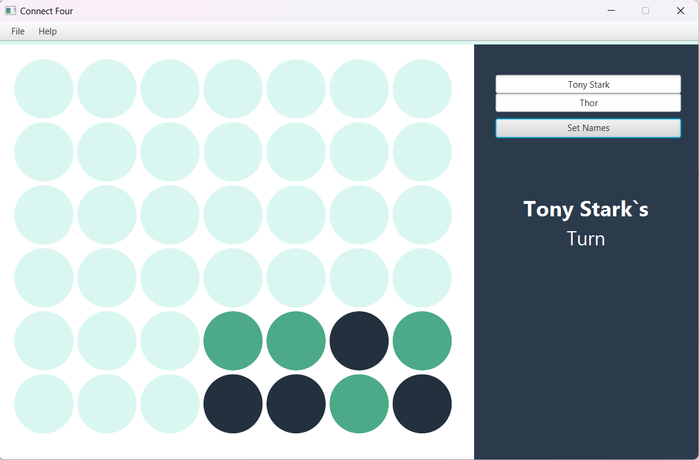

# Connect_4-Game📱

* This is a Connect 4 game created using JavaFX. 
* The game allows two players to play against each other, taking turns to place their pieces on the board and trying to connect four of their pieces in a row.

## ScreenShot➡️

;

## How To Play➡️
* To play the game, each player takes turns placing their pieces on the board by clicking on the desired column. The pieces will drop down to the lowest available space in that column.

* The first player to connect four of their pieces in a row (horizontally, vertically, or diagonally) wins the game. If all spaces on the board are filled without either player connecting four pieces in a row, the game is a tie.

## Acknowledgements➡️
* This game was created using JavaFX , Scene Builder and the IntelliJ IDEA IDE.

 ## :v: ***Contributions are welcome! Feel free to submit pull requests or open issue and don't forget to give STAR🌟:!!***:relaxed:
